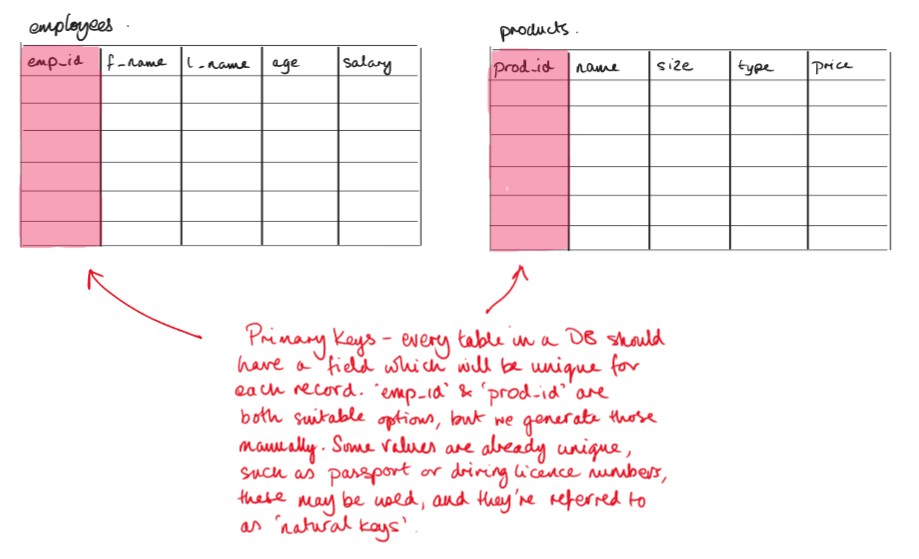
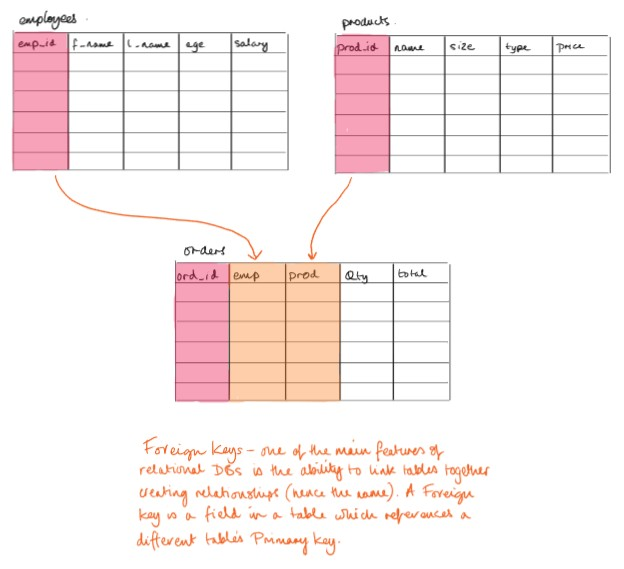
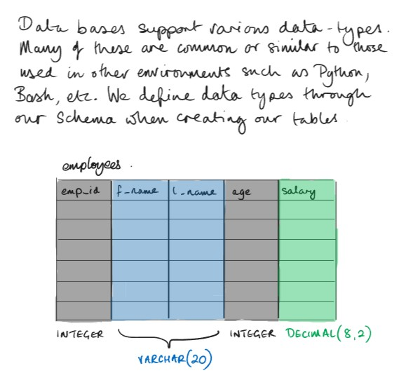

# Intro to T-SQL

## SQL Tables

A database will typically contain multiple tables, but exactly which ones is up to you and your organisation’s needs.

A common example when learning is to model a simple business which needs a `customer_table`, `products_table`, and an `orders_table`.

Tables in SQL are comprised of **fields (columns)** and **records (rows)**. Each record is a new entry in the database, and the fields are the data items captured for each record.

Every record in the table needs a unique identifier, known as a **Primary Key**, since two entries might have the same name.



When one table has a field for another table’s Primary Key — such as an `Orders` table referencing a `Customer_ID` when a purchase is made — we call this a **Foreign Key**.

Linking Primary and Foreign Keys is how we create **relationships** between tables.



---

### SQL Schema

Here’s an example of creating a basic `customers` table in **T-SQL**:

```sql
CREATE TABLE customers (
    customer_id INT IDENTITY(1,1) PRIMARY KEY,
    first_name VARCHAR(30),
    last_name VARCHAR(30),
    age INT CHECK (age > 0)
);
```

* SQL Server uses `IDENTITY(1,1)` instead of MySQL’s `AUTO_INCREMENT`.
* `CHECK` constraints can be used instead of `UNSIGNED` to restrict values.
* All table and column names in T-SQL are **not case-sensitive** by default.

You can verify that your table was created with:

```sql
SELECT TABLE_NAME 
FROM INFORMATION_SCHEMA.TABLES;
```

To see detailed info about your table’s columns:

```sql
EXEC sp_help 'customers';
```

This replaces MySQL’s `DESCRIBE` or `SHOW TABLES` commands.

---

### SQL Data Types

Although different SQL systems have niche data types, most standard ones exist in T-SQL too:

| **Data Type**|**Description**|
|---|---|
| `INT`| Whole numbers.|
| `DECIMAL(p, s)` or `NUMERIC(p, s)`|Decimal numbers with precision and scale. Example: `DECIMAL(8,2)` allows 999,999.99.|
| `CHAR(n)`|Fixed-length string.|
| `VARCHAR(n)`|Variable-length string.|
| `DATE`, `TIME`, `DATETIME`, `DATETIME2`|Date and time formats.|
| `BIT`|Boolean-like (0 = False, 1 = True).|
| `MONEY`|Currency values (SQL Server–specific).|



---

### Practical 2

[Click here for the Practical 2 guide](Practical_2.md)

* Practice creating and dropping databases and tables.
* Use `CREATE`, `DROP`, `USE`, and `sp_help`.
* Explore `INFORMATION_SCHEMA` views to inspect metadata.

---

### Working with Data

You can add records directly using SQL commands in SSMS or automate this through front-end applications.

In production environments, data is often imported/exported using files such as `.csv`, `.xlsx`, or through ETL processes.

---

### Inserting Records

To add records to a table:

```sql
INSERT INTO customers (first_name, last_name, age)
VALUES ('Alice', 'Smith', 33);
```

Note: Because `customer_id` is an `IDENTITY` column, you do **not** include it unless you explicitly turn on identity insert mode.

Verify your data:

```sql
SELECT * FROM customers;
```

---

### Updating Records

To modify existing data:

```sql
UPDATE customers
SET age = 31
WHERE customer_id = 1;
```

Always include a `WHERE` clause — without it, every record will be updated.

---

### Practical 3

[Click here for the Practical 3 guide](Practical_3.md)

* Create `customers` and `products` tables.
* Insert and verify records.
* Practice `UPDATE` statements.

---

### Selecting Records

Retrieving data is done with `SELECT` statements:

```sql
SELECT *
FROM customers
WHERE customer_id = 1;
```

Or select specific columns:

```sql
SELECT first_name, last_name
FROM customers
WHERE customer_id = 3;
```

These queries form the basis of most reporting and data access in business applications such as CRMs and e-commerce platforms.

---

### Practical 4

[Click here for the Practical 4 guide](Practical_4.md)

* Create and populate tables.
* Use `SELECT` statements to explore your data.

---

### More SELECT Statements

#### Comparison Operators

You can filter results numerically or textually using comparison operators.

```sql
SELECT first_name, last_name 
FROM customers 
WHERE age > 30;
```

| **Comparison**   | **Syntax**   |
| ---------------- | ------------ |
| Equal            | `=`          |
| Not equal        | `!=` or `<>` |
| Greater than     | `>`          |
| Greater or equal | `>=`         |
| Less than        | `<`          |
| Less or equal    | `<=`         |

---

#### String Patterns

Use `LIKE` or `NOT LIKE` for string pattern matching.

| **Pattern**               | **Example** |
| ------------------------- | ----------- |
| Starts with `abc`         | `'abc%'`    |
| Ends with `abc`           | `'%abc'`    |
| Contains `abc`            | `'%abc%'`   |
| Exactly 3 characters      | `'___'`     |
| Single character wildcard | `'a_c'`     |

Example:

```sql
SELECT first_name, last_name 
FROM customers 
WHERE first_name LIKE 'Sc%';
```

---

#### Sorting Results

Use `ORDER BY` to control output order:

```sql
SELECT * FROM customers 
WHERE age < 10 
ORDER BY first_name;
```

Multiple fields can be used:

```sql
SELECT * FROM customers 
ORDER BY last_name, first_name;
```

---

#### Deleting Records

```sql
DELETE FROM customers 
WHERE first_name = 'Alice';
```

>Always include a `WHERE` clause, or you’ll delete *all* rows.

---

### Practical 5

[Click here for the Practical 5 guide](Practical_5.md)

* Practice `SELECT` queries, pattern matching, and sorting.
* Try deleting test records.

---

### Multiple Tables

#### Create the Tables

```sql
CREATE TABLE customers (
    customer_id INT IDENTITY(1,1) PRIMARY KEY,
    first_name VARCHAR(30),
    last_name VARCHAR(30),
    age INT CHECK (age > 0)
);

CREATE TABLE products (
    product_id INT IDENTITY(1,1) PRIMARY KEY,
    product_name VARCHAR(100),
    product_price DECIMAL(10,2)
);
```

Now let’s create an `orders` table that references both customers and products:

```sql
CREATE TABLE orders (
    order_id INT IDENTITY(1,1) PRIMARY KEY,
    customer_id INT,
    product_id INT,
    order_date DATE,
    order_quantity INT,
    FOREIGN KEY (customer_id) REFERENCES customers(customer_id),
    FOREIGN KEY (product_id) REFERENCES products(product_id)
);
```

> In SQL Server, both Primary and Foreign Key columns must share the same data type and constraints.

---

#### Add Some Records

```sql
INSERT INTO customers (first_name, last_name, age)
VALUES
    ('Alice', 'Smith', 33),
    ('Alan', 'Jones', 28),
    ('Noche', 'Snead', 3);

INSERT INTO products (product_name, product_price)
VALUES
    ('Ryzen 7 Laptop', 1299.99),
    ('iPhone 14', 799.99),
    ('27"" Monitor', 199.99);

INSERT INTO orders (customer_id, product_id, order_date, order_quantity)
VALUES
    (1, 1, '2023-11-22', 2),
    (2, 2, '2023-11-23', 1),
    (3, 3, '2023-11-24', 3);
```

---

### Practical 6

[Click here for the Practical 6 guide](Practical_6.md)

* Create tables with `PRIMARY KEY` and `FOREIGN KEY` relationships.
* Insert and query records.

---

### Querying Multiple Tables

Now that your tables are related, you can combine data using **JOINs**.

```sql
SELECT customers.first_name, customers.last_name
FROM orders
JOIN customers ON orders.customer_id = customers.customer_id
WHERE orders.order_id = 1;
```

---

### Aliases

Aliases make long queries easier to read:

```sql
SELECT c.first_name, c.last_name
FROM orders o
JOIN customers c ON o.customer_id = c.customer_id
WHERE o.order_id = 1;
```

---

### Join Types

| **Join Type**| **Description**|
|---|---|
|`INNER JOIN`|Returns only matching rows from both tables.|
|`LEFT JOIN`|Returns all rows from the left table, plus matches from the right.|
| `RIGHT JOIN`|Returns all rows from the right table, plus matches from the left.|
| `FULL OUTER JOIN`| Returns all rows from both tables, matching where possible.|

Example:

```sql
SELECT c.first_name, p.product_name, o.order_date
FROM orders o
INNER JOIN customers c ON o.customer_id = c.customer_id
INNER JOIN products p ON o.product_id = p.product_id;
```

---

### Practical 7

[Click here for the Practical 7 guide](Practical_7.md)

* Write queries using different `JOIN` types.
* Use table aliases to simplify longer SQL statements.

---
